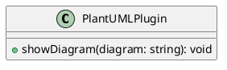

# uTools PlantUML 插件

## 插件介绍

这是一个专为 [uTools](https://u.tools/) 设计的插件，旨在通过优雅展示 PlantUML 语法生成的精美图片，为用户提供一流的体验。

## 主要特性

- 使用简洁的 PlantUML 语法创建图表
- 在 uTools 中即时生成漂亮的图片展示
- 提供直观且交互式的界面

## 如何使用

1. 在 uTools 中安装插件
2. 使用简单的 PlantUML 语法编写图表
3. 即时在 uTools 中查看生成的图片

## 示例

## 注意事项
确保 uTools 已经安装并处于最新状态。

## PlantUML 官网
访问 [PlantUML 官网]() 获取更多关于 PlantUML 语法和用法的信息。

## 联系方式
有关插件使用或反馈意见，请联系我们：260083304@qq.com

